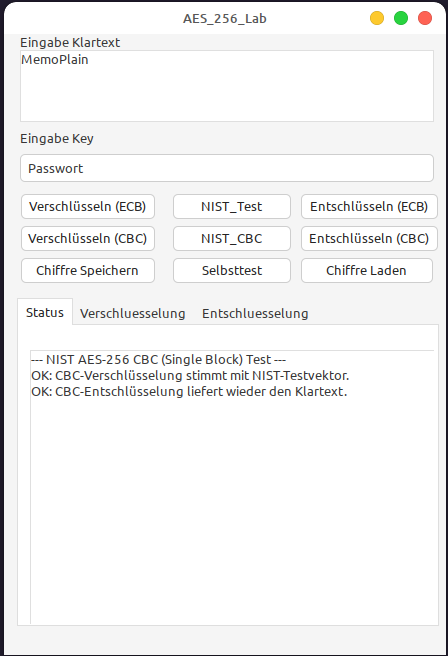

# AES256 Lab (Pascal/Lazarus) — Educational, Transparent Implementation

⚠️ **Educational project — NOT production-grade cryptography!**

This repository implements **AES-256 from scratch in Pascal/Lazarus**, intentionally **without external crypto units or packages**. The goal is transparency and learning: every step is readable and discussable.

**Do not use this code to protect real data.** Real-world security requires much more than “AES works”:
- correct **key derivation** from passwords (KDFs like Argon2/PBKDF2 + salt + iterations)
- correct **IV/nonce** handling and safe defaults
- **integrity & authenticity** (AEAD / MAC) — not only confidentiality
- secure randomness (CSPRNG), key management, error handling
- side-channel considerations, secure wiping, extensive testing & review

If you need real encryption, use well-audited libraries (e.g. libsodium, OpenSSL, Botan, or platform crypto APIs).

---

## Documentation (German project language)

The main documentation is in German:

➡️ **Main documentation (German):** [`README.de.md`](README.de.md)

---

## Quick Start (Lazarus)

1. Open Lazarus
2. Load the project: `src/aes_256.lpi`
3. Build & Run
4. Use the GUI to try encryption/decryption and run tests (if available in the UI)

> Tip: If you run into build output folders, they belong into `lib/` and should be ignored by Git (see `.gitignore`).

---
### Screenshot

## Learning Path (Docs)

This repo includes a step-by-step learning path in `docs/`:

- `docs/00_Project_Map.md`
- `docs/10_AES_Introduction.md`
- `docs/20_AES_Key_Schedule.md`
- `docs/30_AES_Block_Operations.md`
- `docs/40_AES_Modes_ECB_CBC.md`
- `docs/50_Security_Notes.md`

Additional references:

- `docs/60_How_to_verify_with_test_vectors.md`
- `docs/70_Unit_Reference.md`
- `docs/80_Glossary.md`

## Project Structure

- `src/` — Lazarus project + Pascal source code
  - `aes_256.lpr / aes_256.lpi` — project entry
  - `aes_256_lab_main.*` — GUI (main form)
  - `uAES256*.pas` — AES implementation and modes
  - `uSHA256.pas` — SHA-256 implementation (used for educational key derivation)
- `docs/` — educational documentation
- `.github/` — issue/PR templates

---

## License

Licensed under the **GNU Affero General Public License v3.0 (AGPL-3.0)**.  
See [`LICENSE`](LICENSE).

---

## Contributing

Contributions are welcome — especially improvements to documentation, test vectors, and beginner-friendly explanations.

See [`CONTRIBUTING.md`](CONTRIBUTING.md).
---

## Author / Motivation

Created by **Jörg Liebetanz** as a transparent AES-256 learning project in Pascal/Lazarus (no external crypto packages), focused on readability and education.

If you use this for teaching or want to contribute improvements (docs/tests), feel free to open an issue or PR.

