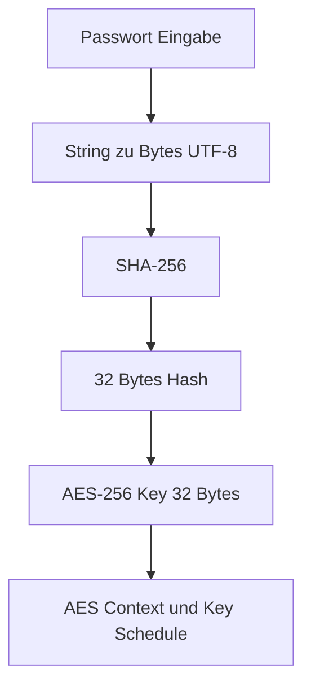

# Passwort → 32-Byte AES-Schlüssel (Educational, Schritt für Schritt)

Dieses Dokument zeigt, wie in diesem Lernprojekt aus einem eingegebenen Passwort ein **32-Byte (256 Bit) AES-256 Schlüssel** entsteht.

**Wichtig:** In diesem Lernprojekt wird der AES-Key **direkt** als **SHA-256 Hash** des Passworts verwendet.  
Das ist didaktisch einfach und transparent, aber **nicht** als sichere Passwort-basierte Schlüsselableitung für echte Anwendungen gedacht (siehe Hinweis am Ende).

---

## Ablauf (grafisch)

# Beispiel: Passwort "HalloWelt"

**Schritt 1 — Eingabe (String)**

Eingabe:
HalloWelt

**Im Speicher (als Zeichenfolge):**
H a l l o W e l t

**Schritt 2 — String → Bytes (UTF-8)**

UTF-8 kodiert die Zeichen hier 1:1 als Bytes (ASCII-kompatibel).

**Ergebnis: PasswordBytes (Hex):**
48 61 6C 6C 6F 57 65 6C 74

Ergebnis: PasswordBytes (Dezimal):
72 97 108 108 111 87 101 108 116

Länge:
9 Bytes

# Schritt 3 — SHA-256 über PasswordBytes

Jetzt wird SHA-256 über genau diese 9 Bytes berechnet.

**Ergebnis (aus dem Programm):**
Len=32: (142, 223, 10, 173, 94, 177, 117, 33, 184, 35, 34, 30, 245, 163, 198, 135, 27, 61, 61, 59, 207, 38, 210, 39, 143, 161, 43, 138, 115, 34, 158, 9)

**HashBytes (32 Bytes) (Dezimal, sauber formatiert):**
142,223,10,173,94,177,117,33,184,35,34,30,245,163,198,135,27,61,61,59,207,38,210,39,143,161,43,138,115,34,158,9

**HashBytes (32 Bytes) (Hex, gruppiert):**
8E DF 0A AD 5E B1 75 21 B8 23 22 1E F5 A3 C6 87
1B 3D 3D 3B CF 26 D2 27 8F A1 2B 8A 73 22 9E 09

**HashBytes (Hex, als String):**
8EDF0AAD5EB17521B823221EF5A3C6871B3D3D3BCF26D2278FA12B8A73229E09

Länge:
32 Bytes (SHA-256 ist immer 32 Bytes)

# Schritt 4 — HashBytes = AES-256 Key (32 Bytes)

In diesem Lernprojekt gilt:

**AES-Key = SHA-256 Hash**

Damit ist der AES-256 Schlüssel identisch zum Hash aus Schritt 3.

**AESKey[0..31] (Hex, gruppiert):**
8E DF 0A AD 5E B1 75 21 B8 23 22 1E F5 A3 C6 87
1B 3D 3D 3B CF 26 D2 27 8F A1 2B 8A 73 22 9E 09

**AESKey (Hex, als String):**
8EDF0AAD5EB17521B823221EF5A3C6871B3D3D3BCF26D2278FA12B8A73229E09

# Schritt 5 — Key Schedule / AES Context (Ausblick)

Aus dem 32-Byte AES-Key werden die **Round Keys** berechnet (AES-256 hat **14 Runden**).
Diese Rundenschlüssel werden dann in der Blockverschlüsselung pro Runde per AddRoundKey eingemischt.

(Das detaillierte “Wie” kommt in einem eigenen Dokument zur Key Schedule / Round Keys.)

# Wo im Code finde ich das?

GUI / Passwort-Eingabe: src/aes_256_lab_main.pas

SHA-256 Implementierung: src/uSHA256.pas

AES Key Schedule / Blockfunktionen: src/uAES256.pas

# Wichtiger Hinweis (Security)

Passwort → SHA-256 → Key ist für Lernzwecke leicht nachvollziehbar, aber als echtes Verfahren zu schwach:

Passwörter sind oft erratbar

SHA-256 ist schnell → Angreifer können sehr viele Kandidaten pro Sekunde testen

Für reale Anwendungen nutzt man stattdessen:

KDFs (PBKDF2 / Argon2 / scrypt) **+ Salt + Parameter**

und kombiniert Verschlüsselung mit Integrität (AEAD), z.B. AES-GCM oder ChaCha20-Poly1305

**Siehe dazu: docs/50_Security_Notes.md**
