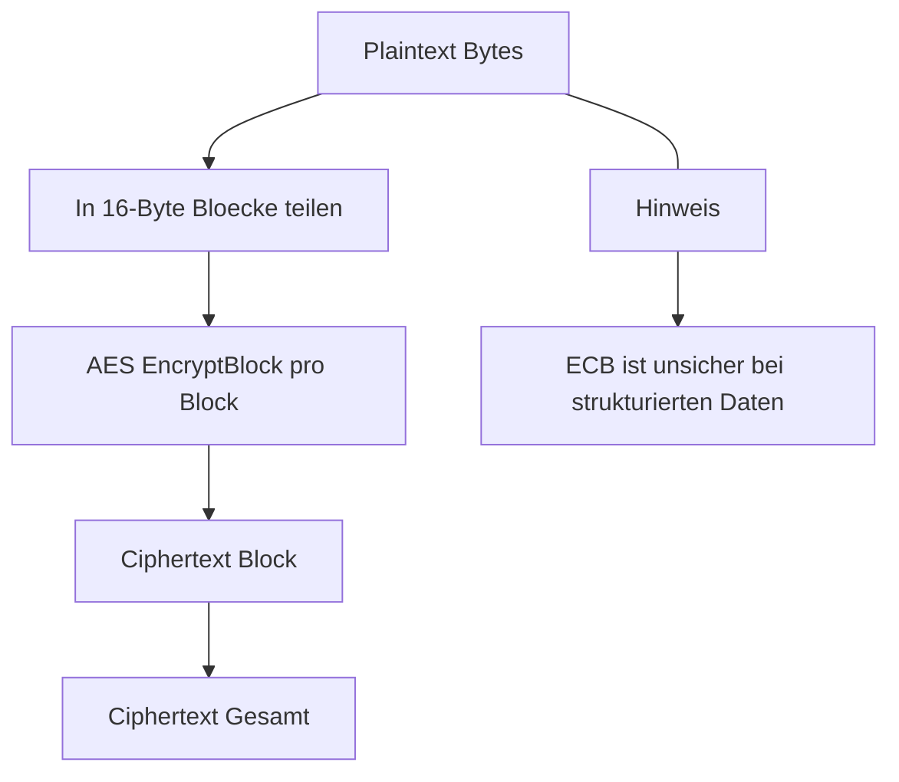

# ECB Verschlüsselung (Educational) — Schritt für Schritt

ECB (Electronic Codebook) verschlüsselt jeden 16-Byte Block **unabhängig** mit AES.
Das ist didaktisch einfach, aber für echte Daten gefährlich, weil Muster sichtbar bleiben.

---

## Ablauf (grafisch)

---

---

# Eingaben
**AES-256 Key (32 Bytes)**

Dieser Key stammt aus dem vorherigen Dokument (Passwort "HalloWelt" → SHA-256 → Key).

**Key (Hex, 32 Bytes):**
8E DF 0A AD 5E B1 75 21 B8 23 22 1E F5 A3 C6 87 1B 3D 3D 3B CF 26 D2 27 8F A1 2B 8A 73 22 9E 09

# Schritt für Schritt

**Schritt 1 — Plaintext Bytes**

Du startest mit deinen Klartext-Bytes.

Hinweis: In deinem Output sieht man bereits, dass nach dem Padding 32 Bytes verarbeitet wurden
(Len=32). Das bedeutet: Nach dem Padding liegen 2 AES-Blöcke vor.

**Schritt 2 — Padding auf Blockgrenze**

AES arbeitet blockweise mit 16 Bytes.
Wenn die Eingabe nicht exakt ein Vielfaches von 16 Bytes ist, wird sie aufgefüllt (Padding).

**Ergebnis:**
PaddedBytes hat eine Länge von 32 Bytes.

# Schritt 3 — Blockbildung (16-Byte Blöcke)

PaddedBytes wird in Blöcke zerlegt:

Block 0: Bytes 0..15

Block 1: Bytes 16..31

**Anzahl Blöcke:**
2

# Schritt 4 — AES EncryptBlock pro Block (ECB)

Jetzt wird jeder Block separat verschlüsselt:

C0 = AES_EncryptBlock(P0, Key)

C1 = AES_EncryptBlock(P1, Key)

Die Ausgabe ist CipherBytes und hat dieselbe Länge wie PaddedBytes.

**Ergebnis (aus dem Programm)**

Du hast ausgegeben:

Len=32: (57, 63, 216, 24, 20, 141, 106, 34, 134, 39, 137, 233, 9, 227, 105, 249, 182, 69, 158, 93, 185, 172, 93, 81, 205, 71, 16, 196, 41, 214, 209, 224)

**CipherBytes (Dezimal)**

57,63,216,24,20,141,106,34,134,39,137,233,9,227,105,249,182,69,158,93,185,172,93,81,205,71,16,196,41,214,209,224

**CipherBytes (Hex, gruppiert in 2 Blöcke)**

Block 0 (Bytes 0..15):
39 3F D8 18 14 8D 6A 22 86 27 89 E9 09 E3 69 F9

Block 1 (Bytes 16..31):
B6 45 9E 5D B9 AC 5D 51 CD 47 10 C4 29 D6 D1 E0

**CipherBytes (Hex, als String)**

393FD818148D6A22862789E909E369F9B6459E5DB9AC5D51CD4710C429D6D1E0

**Was man bei ECB lernen soll (und warum es unsicher ist)**

ECB verschlüsselt identische Klartextblöcke bei gleichem Key immer zu identischen Cipherblöcken.
Darum bleiben Muster bei strukturierten Daten sichtbar.

ECB ist daher als realer Betriebsmodus praktisch nie geeignet.

**Wo im Code?**

ECB Modus: src/uAES256_ECB.pas

AES Blockverschlüsselung: src/uAES256.pas

**Die entscheidende Zeile in deinem Ablauf ist:**
CipherBytes := AES256EncryptECB(PaddedBytes, Ctx);
